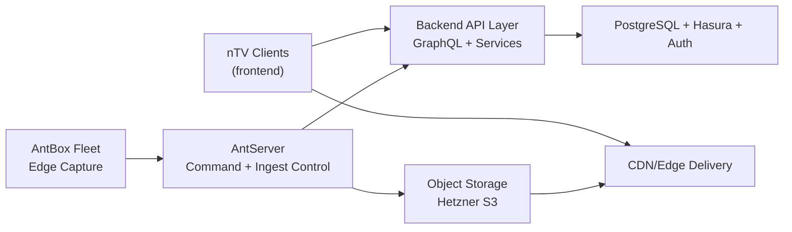

# 03 - Architecture Reference

## Logical Architecture

## Plane Separation

1. Control plane: scheduling, policy, device trust, command dispatch.
2. Data plane: media ingest, packaging, storage, delivery, playback sessions.
3. Edge plane: tuner lock/capture/encode and local resilience.

## Environment Layers

1. Local: nSelf CLI stack with deterministic fixtures.
2. Staging: production-like contracts and load tests.
3. Production: Hetzner VPS + HOS + configurable CDN/edge.

## Cross-Cutting Requirements

1. strict tenant and role boundaries
2. server-authoritative stream/session policy enforcement
3. deterministic event state transitions
4. full auditability of privileged controls
5. tested backup/restore and incident runbooks
