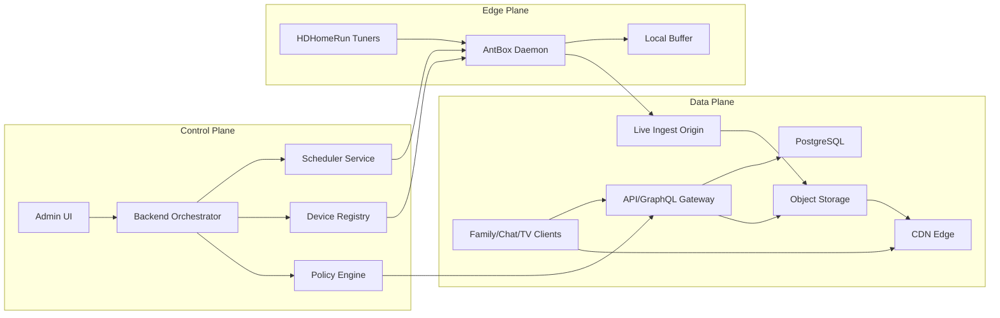

# 15 - System Architecture: Control Plane and Data Plane

## Objective

Define one canonical architecture reference to prevent ambiguity between orchestration/control responsibilities and user/media data movement.

## Canonical Diagram

## Responsibility Boundaries

### Control Plane

- Owns scheduling, policy decisions, enrollment, and command dispatch.
- Must never be bypassed for privileged operations.
- All control actions emit audit events.

### Data Plane

- Owns content reads/writes, playback traffic, metadata, and user interactions.
- Must enforce policy decisions from control plane.
- Must remain resilient during control-plane partial outages.

### Edge Plane

- Owns tuner interaction and capture/encode execution.
- Receives signed commands only.
- Must fail-safe and report telemetry continuously.

## Failure Isolation Rules

1. Control-plane outages must not immediately terminate already-running playback sessions.
2. Data-plane outages must not corrupt scheduler state.
3. Edge-plane outages must be isolated to affected devices/events.
